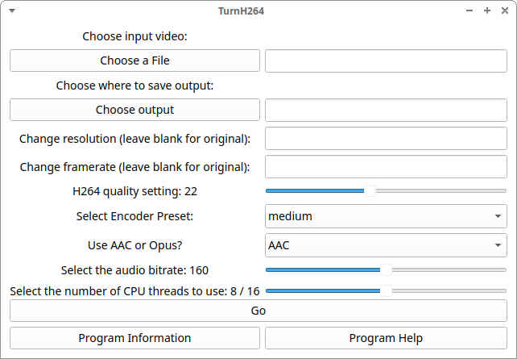

# TurnH264
## A simple GUI program that converts the selected video into H264 using FFmpeg.

How to run from source (Every OS):  
Install PySide6: `pip install PySide6`  
Place an `ffmpeg` executable in the same directory as `TurnH264.py`  
FFmpeg builds are available at https://www.ffmpeg.org/download.html  
Everything should work on Windows and Linux, macOS is untested.

### Would like to implement:
-   [] Progress bar
-   [X] FFmpeg downloader
-   [] FFmpeg NVENC build support